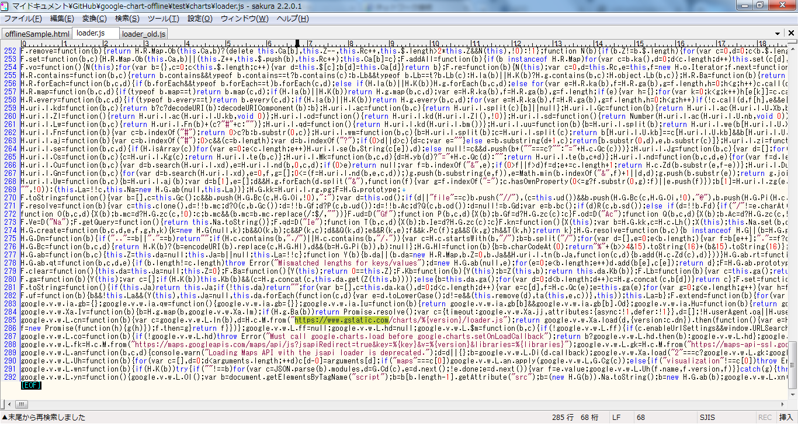
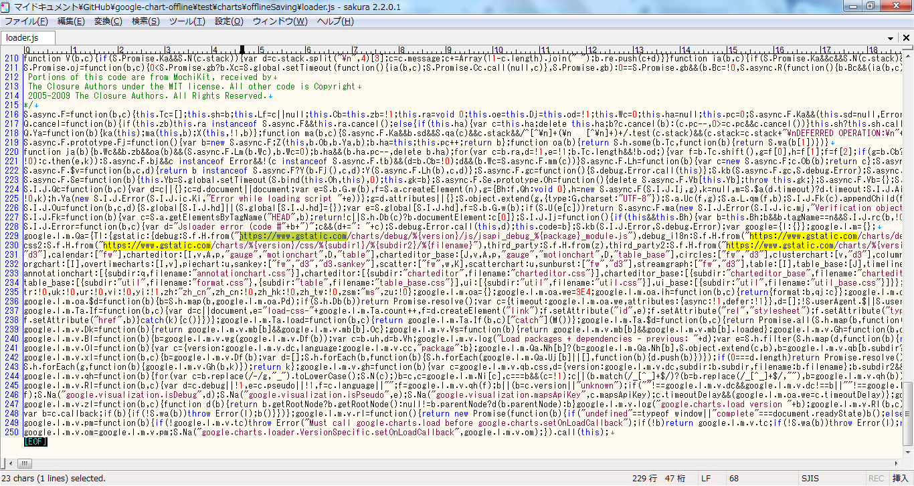
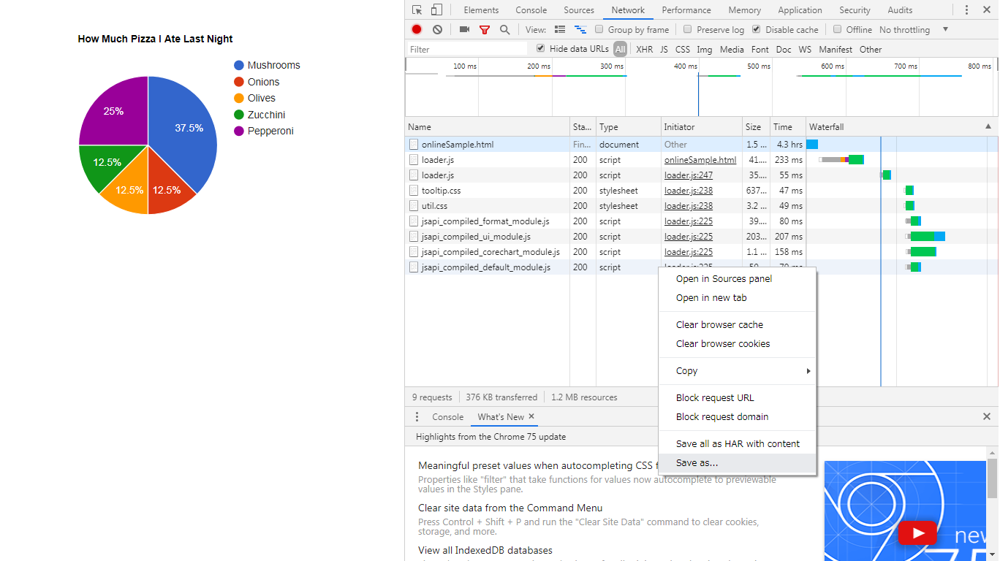

# google-chart-offline
I record google chart and find it will be local if you change several keywords in the two load.js. I upload it here but dont use it in your application because it is out of the license of google chart.

<h3>./charts/loader.js</h3>
Replace "https://www.gstatic.com" to "." .

Change current version from "46" to "offlineSaving" .

<h3>./charts/{version}/loader.js</h3>
Replace "https://www.gstatic.com" to "." .

<h3>Record Other Resources</h3>
Save Other resource in offlinesaving/js or /css folder.

